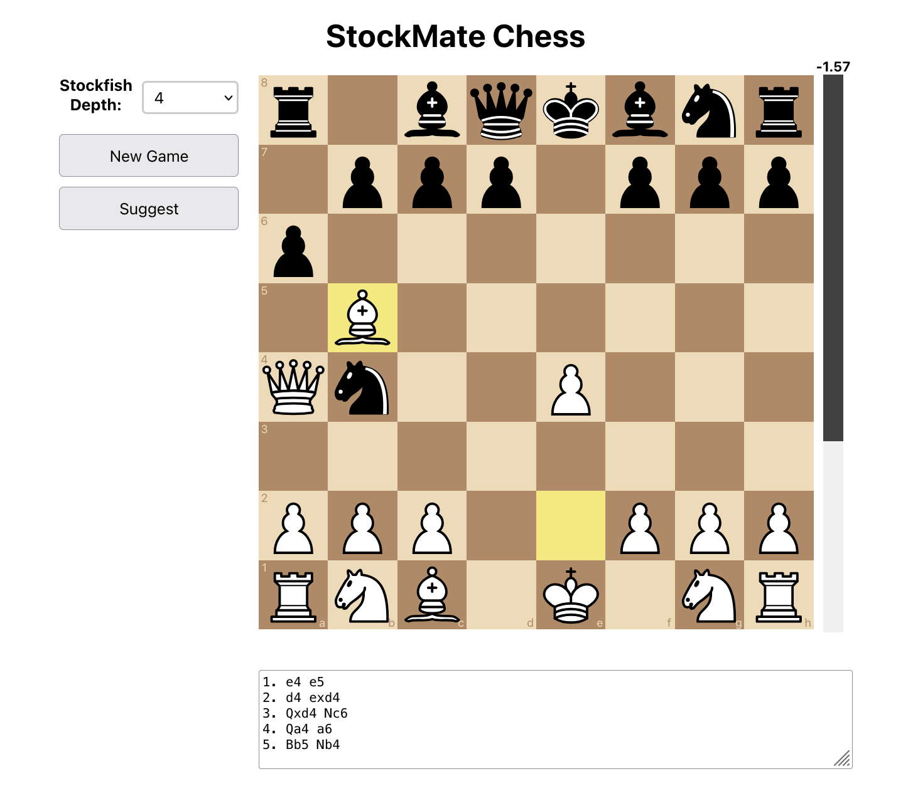
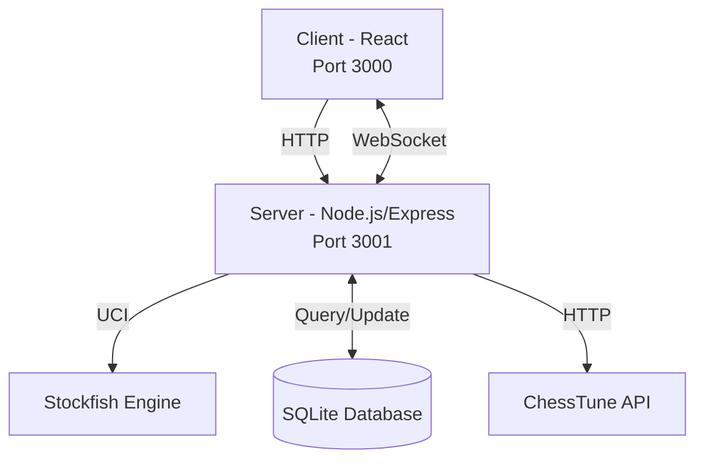

# StockMate Chess

StockMate Chess is a web application that allows you to play chess with a local Stockfish engine or against other online players.

It is built with React and TypeScript for the frontend and Express and Node.js for the backend, mainly because I wanted to learn how to build a web app with these technologies.



## Getting Started

The application consists of two parts: a client (frontend) and a server (backend). They need to be started separately and run on different ports.

1. Start the server (runs on port 3001):
   ```
   npm start
   ```

2. In a new terminal, start the client (runs on port 3000):
   ```
   cd client
   npm start
   ```

After starting both the server and client, you can access the application by opening a web browser and navigating to `http://localhost:3000`.

### Prerequisites

Install Stockfish on your Mac:

    brew install stockfish

on Ubuntu:

    apt install stockfish

## System Overview

StockMate Chess is structured as a full-stack application with the following main components:

1. **Client**: A React-based frontend application (port 3000)
2. **Server**: A Node.js backend server using Express (port 3001)
3. **WebSocket**: Real-time communication between client and server
4. **Database**: SQLite database for storing user information and game data
5. **Stockfish Engine**: Local chess engine for AI gameplay

### Architecture Diagram

This diagram shows the high-level architecture of the StockMate Chess system, illustrating the relationships between the main components.



### Component Details

1. **Client** (Port 3000):
   - Built with React and TypeScript
   - Uses custom hooks for game logic, authentication, and WebSocket communication
   - Includes components for the chessboard, evaluation bar, and user authentication
   - Communicates with the server via HTTP requests and WebSocket

2. **Server** (Port 3001):
   - Built with Node.js and Express
   - Handles HTTP requests for user authentication and game management
   - Manages WebSocket connections for real-time game updates and player interactions
   - Interfaces with the Stockfish chess engine using the UCI protocol
   - Interacts with the SQLite database for user and game data persistence
   - Communicates with the ChessTune API for additional AI gameplay options

3. **WebSocket**:
   - Enables real-time, bidirectional communication between client and server
   - Used for:
     - Sending and receiving game moves
     - Updating online user list
     - Handling player challenges and responses
     - Starting games between players

4. **Database**:
   - Uses SQLite to store user information and game data
   - Manages user accounts, authentication, and ELO ratings

5. **Stockfish Engine**:
   - Local chess engine for AI gameplay
   - Communicates with the server using the Universal Chess Interface (UCI) protocol
   - Provides move suggestions and board evaluations

6. **ChessTune API**:
   - External chess AI service
   - Offers an alternative AI opponent to Stockfish

### Real-time Features

StockMate Chess implements several real-time features using WebSocket:

- Live updates of online players
- Real-time chess gameplay between online players
- Instant challenge system for initiating games
- Live game state synchronization

These features provide a dynamic and interactive user experience, allowing for seamless multiplayer gameplay and social interactions within the application.

## Some more Notes about the application

When you run npm start, the following happens:

- `package.json lookup`: npm first looks for a package.json file in the current directory. This file is the heart of any Node.js project using npm.
- `scripts section check`: Inside package.json, it searches for a scripts section. This section defines various commands that can be run using npm run <command>.
- `start script execution`: The npm start command specifically looks for a "start" key within the scripts section. The value associated with "start" is the command that npm will execute.
- `Command execution`: The value of the "start" script is then executed in your shell. This could be a simple command like node server.js, a more complex command involving multiple processes, or a command invoking another tool (like webpack, Parcel, or a build system).

In our client code we find a `package.json`file where the `scripts` part contain:

- `"start": "react-scripts start"` which means that when you run npm start (or yarn start), npm will execute the command: `react-scripts start`.

Let's break it down:

- `react-scripts`: This refers to the package react-scripts, which is a crucial part of Create React App (CRA). CRA is a popular tool for bootstrapping React applications. It provides a pre-configured development environment, including tools for building, testing, and running your React app.

- `start`: This is the name of a command provided by react-scripts. When you run react-scripts start, it initiates the development server for your React application. This server does the following:

- Compiles your code: It uses Babel to transpile your modern JavaScript code (including JSX) into something older browsers can understand.
Runs a webpack development server: Webpack bundles your code, assets (images, CSS, etc.), and dependencies into optimized bundles for efficient loading in the browser. It also handles things like hot module replacement (HMR), allowing changes to your code to be reflected in the browser without a full page reload.
- Starts a local web server: This makes your app accessible through a web browser at a specified URL (usually http://localhost:3000, but this can be configurable). It watches for changes in your source files and automatically recompiles and updates the browser as you save changes.

In essence, `react-scripts start` sets up the entire development environment necessary for building and running your React application, handling all the complex configuration under the hood so you don't have to deal with it directly. It simplifies the development workflow significantly.
