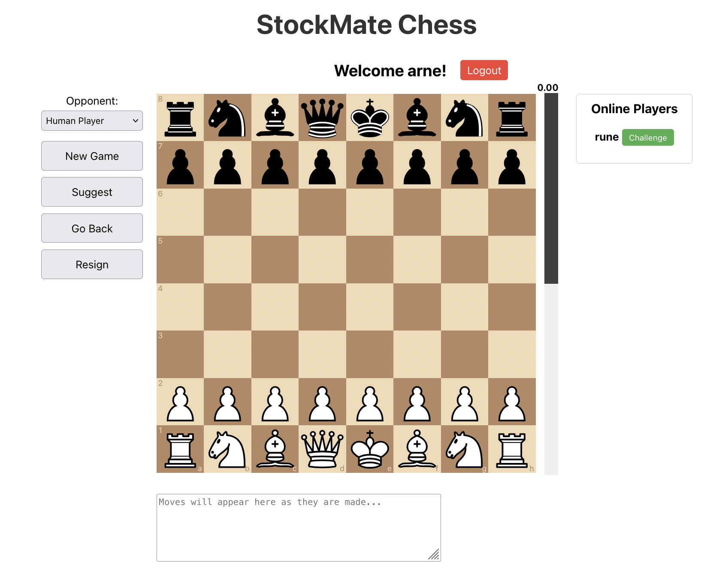

# StockMate Chess

StockMate Chess is a web application that allows you to play chess with a local Stockfish engine.

It is built with React and TypeScript for the frontend and Express and Node.js for the backend, mainly because I wanted to learn how to build a web app with these technologies.

## Getting Started

Start the server:

    npm start

Start the client:

    cd client
    npm start

### Prerequisites

Install Stockfish on your Mac:

    brew install stockfish

on Ubuntu:

    apt install stockfish

## System Overview

StockMate Chess is structured as a full-stack application with three main components:

1. **Client**: A React-based frontend application
2. **Server**: A Node.js backend server using Express
3. **WebSocket**: Real-time communication between client and server

The system also integrates with a local Stockfish chess engine for AI gameplay.

### Architecture Diagram

### Component Details

1. **Client**:
   - Built with React and TypeScript
   - Uses custom hooks for game logic, authentication, and WebSocket communication
   - Includes components for the chessboard, evaluation bar, and user authentication
   - Communicates with the server via HTTP requests and WebSocket

2. **Server**:
   - Built with Node.js and Express
   - Handles HTTP requests for user authentication and game management
   - Manages WebSocket connections for real-time game updates
   - Interfaces with the Stockfish chess engine using the UCI protocol
   - Interacts with the database for user and game data persistence

3. **WebSocket**:
   - Enables real-time, bidirectional communication between client and server
   - Used for sending and receiving game moves and updates

4. **Database**:
   - Stores user information and game data
   - Likely uses SQLite (based on the presence of `chess_users.db` file)

5. **Stockfish Engine**:
   - Local chess engine for AI gameplay
   - Communicates with the server using the Universal Chess Interface (UCI) protocol

